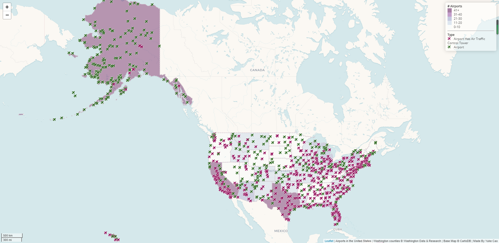
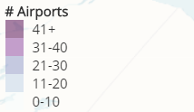

# Web-Map-Application
**The Web-Map of the Airports in the United States**

**Description**

This is an interactive web map of the airports in the United States. I use different color to repersent the type of the airports. The "purple-airplane" repersent the airport has air traffic control tower, the "green-airplane" repersent the normal airports. Also, I set the differnet color range to repersent the five different color level of the airports:

For the airplane icon, the description of each airport which contains the name and the location (city, state) of the airport will popip when clicking it.

**Source**
-  `airports.geojson` contains all the airports in the United States. This data is converted from a shapefile, which was downloaded and unzipped from <https://catalog.data.gov/dataset/usgs-small-scale-dataset-airports-of-the-united-states-201207-shapefile>.
-  `us-states.geojson` is a geojson data file containing all the states' boundaries of the United States. This data is acquired from [Mike Bostock](http://bost.ocks.org/mike) of [D3](http://d3js.org/).
